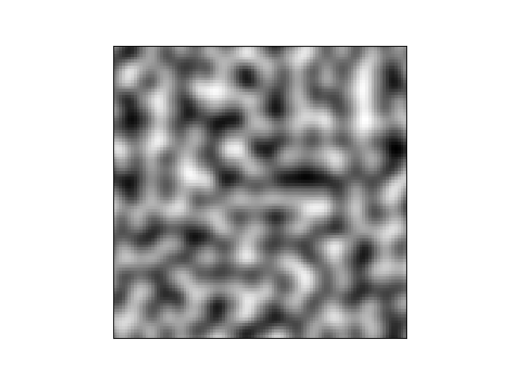
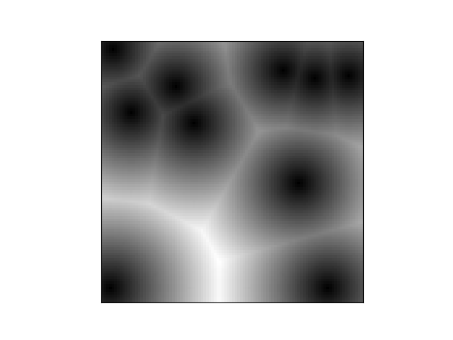

# Noise Generation

This project aims to explore and to test several noise generation algorithms. So far, these algorithms are implemented :

## [Perlin Noise](https://en.wikipedia.org/wiki/Perlin_noise)

Ken Perlin developed Perlin noise in 1982. It helps to generate terrain (height maps) and natural textures.
The main steps of his algorithm are :
1. Grid definition: define a grid and associate a random vector with each corner of the grid
2. Dot product: compute the dot product between the closest corners of the grid and the offest vectors relative to these corners
3. Interpolation: Smooth the result of the dot products

- [x] Perlin noise 1D - class PerlinNoise1D
- [x] Perlin noise 2D - class PerlinNoise2D
- [x] Perlin noise 3D - class PerlinNoise3D
- [x] [Perlin noise with octaves](https://rtouti.github.io/graphics/perlin-noise-algorithm)

Example of Perlin Noise generation in 2D and 3D:

## [Worley noise](https://en.wikipedia.org/wiki/Worley_noise)

Steven Worley his noise generation algorithm in 1996, also called **Voronoi noise** or **Cellular noise**. 
It is used to generate textures.
The main steps of his algorithm are :
1. Create N control points (N is a parameter to choose)
2. For each point, find the closest control point and compute the distance between the point and the control point

- [x] Worley noise - class WorleyNoise
- [x] Worley noise 1D
- [x] Worley noise 3D

Example of Worley Noise generation in 2D and 3D :

## [Simplex noise](https://en.wikipedia.org/wiki/Simplex_noise)
- [ ] Simplex Noise 1D - In progress
- [ ] Simplex Noise 2D
- [ ] Simplex Noise 3D

# Next Steps :

- [ ] Unit tests and logging
- [x] Optimized Worley and Perlin noise using numpy
